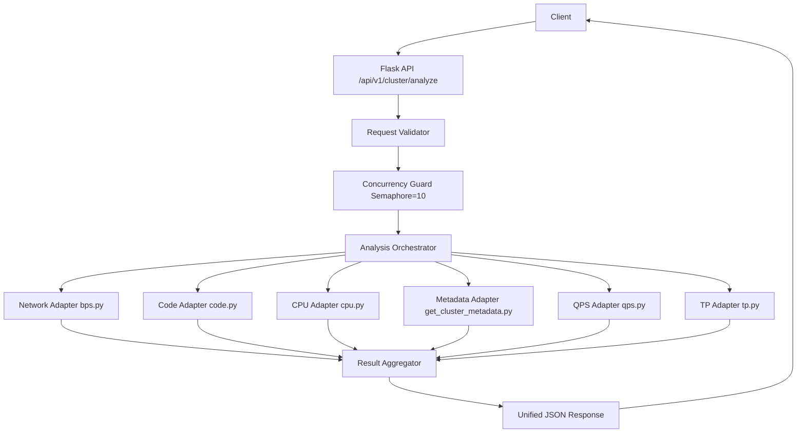

# Design Document

## Overview
本设计实现一个基于 Flask 的统一分析服务，提供单一接口接收 `start_time`、`end_time`、`cluster_name`，并并发调用六类分析能力：
- network: `tools/bps.py:get_cluster_network_analysis`
- code: `tools/code.py:get_cluster_status_code_analysis`
- cpu: `tools/cpu.py:get_cluster_cpu_analysis`
- metadata: `tools/get_cluster_metadata.py:get_cluster_metadata`
- qps: `tools/qps.py:get_cluster_qps_analysis`
- tp: `tools/tp.py:get_cluster_connect_delay_analysis`

服务目标：
1. 单次请求聚合六类分析结果并统一返回。
2. 并发能力固定为 `10`（并发=10），含入口并发控制和内部执行池控制。
3. 单次请求内六个工具调用必须并行发起（非串行），并支持部分失败可返回（partial success）。
4. 提供可观测性数据，能追踪并行执行时的每工具耗时与状态。

关键设计决策：
- 采用同步 Flask + 线程池模型，避免对现有 `tools/*.py` 大规模异步改造。
- `network` 能力映射到 `bps.py`，避免引入不存在的 `network.py`。
- 接口返回标准化 envelope，保障上层调用稳定性。

## Architecture



运行时结构：
- Web 层: Flask 路由、输入校验、HTTP 状态码映射。
- 编排层: 任务创建、线程池并发执行、超时控制、结果聚合。
- 适配层: 每个工具一个 adapter，隔离函数签名差异与异常。
- 控制层: 入口并发闸门（Semaphore=10）+ 内部执行池（max_workers=10）。

## Components and Interfaces

1. API Layer
- Endpoint: `POST /api/v1/cluster/analyze`
- Request:
```json
{
  "start_time": "2026-01-13 09:00:00",
  "end_time": "2026-01-13 09:30:00",
  "cluster_name": "ga-lan-jdns1"
}
```
- Success status:
  - `200`: 全成功或部分成功。
- Error status:
  - `400`: 参数非法。
  - `429`: 超过并发上限 10。
  - `500/502`: 全工具失败或系统异常。

2. Validator
- 校验时间格式 `YYYY-MM-DD HH:MM:SS`。
- 校验 `start_time < end_time`。
- 校验 `cluster_name` 非空且长度在安全阈值内（建议 <= 128）。

3. Concurrency Guard
- 全局 `BoundedSemaphore(10)` 控制同一服务实例同时处理请求数。
- 获取失败立即返回 `429`（可配置为短暂等待再失败）。

4. Analysis Orchestrator
- 输入: `cluster_name, start_time, end_time`
- 执行方式:
  - 构造固定六个任务（network/code/cpu/metadata/qps/tp）。
  - 使用 `ThreadPoolExecutor(max_workers=min(10, len(tasks)))`。
  - 在同一请求中先一次性提交全部六个 future，再统一等待结果，确保为并行调用而非串行调用。
  - 单任务超时默认 `30s`（可配置）。
- 输出: 每个工具 `{status, data, error, latency_ms}`。

5. Tool Adapters
- `run_network`: 调用 `get_cluster_network_analysis`。
- `run_code`: 调用 `get_cluster_status_code_analysis`。
- `run_cpu`: 调用 `get_cluster_cpu_analysis`。
- `run_metadata`: 调用 `get_cluster_metadata`。
- `run_qps`: 调用 `get_cluster_qps_analysis`。
- `run_tp`: 调用 `get_cluster_connect_delay_analysis`。

每个 adapter 统一行为：
- 捕获异常并返回标准错误对象。
- 记录耗时。
- 不向外抛出未处理异常，避免拖垮整次聚合。

6. Response Builder
- 汇总六个工具结果。
- 计算 `summary.success_count / failure_count / timeout_count`。
- 产生建议 HTTP 状态码：
  - 至少一个成功 -> `200`
  - 全部失败 -> `502`（下游依赖失败）或 `500`（本地逻辑错误）

## Data Models

1. Internal Task Result
```json
{
  "tool": "network",
  "status": "success",
  "data": {},
  "error": null,
  "latency_ms": 1520
}
```

2. Standard API Response
```json
{
  "request_id": "9f1e6d09f8624d5da3186fb8f64f6ea2",
  "input": {
    "start_time": "2026-01-13 09:00:00",
    "end_time": "2026-01-13 09:30:00",
    "cluster_name": "ga-lan-jdns1"
  },
  "summary": {
    "success_count": 5,
    "failure_count": 1,
    "timeout_count": 0
  },
  "results": {
    "network": {"status": "success", "data": {}, "error": null, "latency_ms": 1500},
    "code": {"status": "success", "data": {}, "error": null, "latency_ms": 1200},
    "cpu": {"status": "success", "data": {}, "error": null, "latency_ms": 980},
    "metadata": {"status": "success", "data": {}, "error": null, "latency_ms": 400},
    "qps": {"status": "success", "data": {}, "error": null, "latency_ms": 1400},
    "tp": {"status": "error", "data": null, "error": "timeout", "latency_ms": 30000}
  }
}
```

3. Status Enum
- `success`: 正常返回有效数据。
- `empty`: 正常调用但无数据。
- `timeout`: 超时。
- `error`: 异常或返回不可解析。

## Error Handling

错误处理矩阵：
1. 参数错误
- 场景: 缺字段、时间格式错误、时间范围非法。
- 处理: 返回 `400` + 字段级错误描述。

2. 并发超限
- 场景: 当前在处理请求数 >= 10。
- 处理: 返回 `429` + `{"error":"too_many_requests"}`。

3. 单工具失败
- 场景: 工具抛异常、返回错误结构、网络错误。
- 处理: 该工具标记 `error`，其余工具继续。

4. 单工具超时
- 场景: 超过 `TOOL_TIMEOUT_SECONDS`。
- 处理: 该工具标记 `timeout`，其余工具继续。

5. 全量失败
- 场景: 六个工具全部 `error/timeout`。
- 处理: 返回 `502`（依赖失败）或 `500`（本地错误），附失败摘要。

6. 不可预期异常
- 场景: 编排层内部异常。
- 处理: 记录异常堆栈，返回 `500`，不暴露敏感信息。

日志规范：
- 每次请求生成 `request_id`。
- 记录输入参数（脱敏后）、总耗时、每工具耗时、状态、异常摘要。

## Testing Strategy

1. Unit Tests
- 参数校验：时间格式、空参、时间先后。
- 结果构建：不同工具状态组合下 `summary` 与 HTTP 状态码。
- Adapter 异常：模拟抛异常/超时，确认状态映射正确。

2. Integration Tests
- 使用 Flask test client 调接口。
- mock 六个工具函数，覆盖：全成功、部分失败、全部失败。
- 验证响应结构固定字段：`request_id/input/summary/results`。

3. Concurrency Tests
- 构造 >= 20 并发请求压测。
- 验证同一时刻最多 10 个请求进入处理逻辑。
- 验证超限请求收到 `429` 或进入受控排队策略。

4. Resilience Tests
- 注入慢调用（>30s）验证 timeout 路径。
- 注入异常响应（非预期结构）验证容错能力。

5. Non-Functional Targets
- 在六工具均正常条件下，P95 接口耗时应接近最慢工具耗时 + 编排开销。
- 并发=10 时服务不出现进程崩溃或线程泄漏。

## Research Findings and References

本设计基于当前代码库的函数能力映射与调用约束：
- network 实际实现位于 `tools/bps.py`，入口函数为 `get_cluster_network_analysis`。
- code 入口函数为 `tools/code.py:get_cluster_status_code_analysis`。
- cpu 入口函数为 `tools/cpu.py:get_cluster_cpu_analysis`。
- metadata 入口函数为 `tools/get_cluster_metadata.py:get_cluster_metadata`。
- qps 入口函数为 `tools/qps.py:get_cluster_qps_analysis`。
- tp 入口函数为 `tools/tp.py:get_cluster_connect_delay_analysis`。

以上为本次设计的直接研究来源（仓库内一手代码），可直接用于实现阶段。
